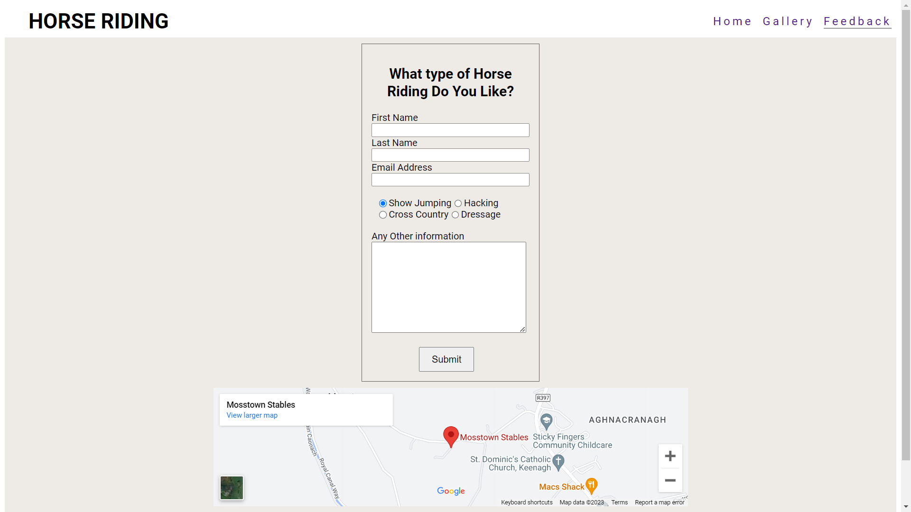
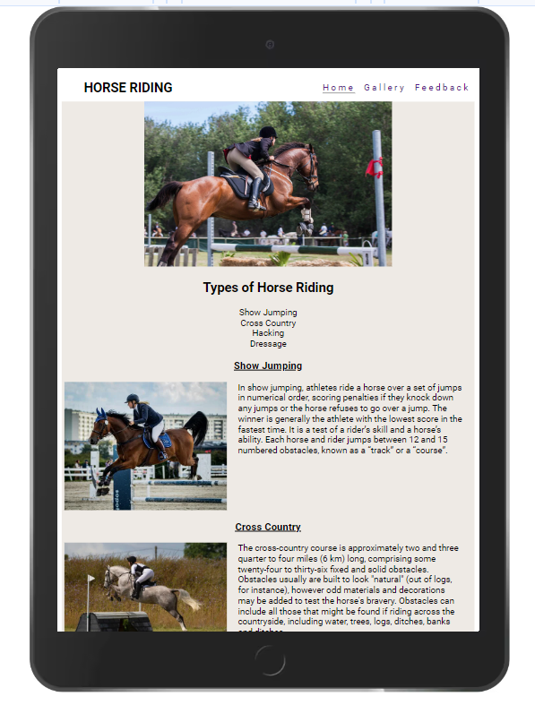
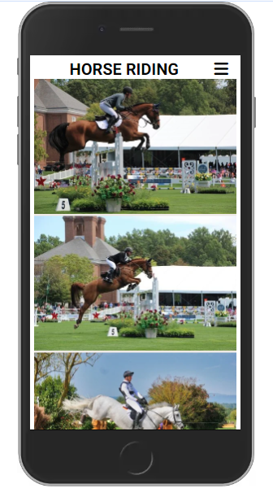
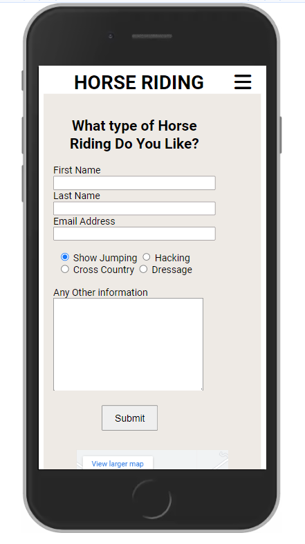
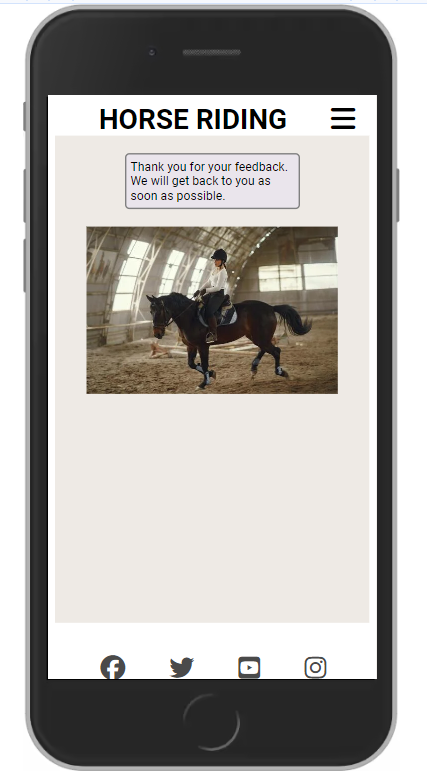

# Horse Riding

Click [here](https://soro82.github.io/horse-riding/) for the live link.

## Introduction

The Horse Riding website is for people who like horse riding or who are interested in starting horse riding. It tells the user the different types of horse riding and gives some information on each type.

There are pictures in the Gallery page of people horse riding in the different types of horse riding. The feedback page allows the user to tell us what type of horse riding they enjoy.

## Table of Contents

* [User Stories](#user-stories)
* [Wireframes](#wireframes)
* [Design](#design)
* [Features](#features)
* [Responsiveness](#responsiveness)
* [Testing](#testing)
* [Deployment](#deployment)
* [Credits](#credits)

## User Stories

* As a user I want to know about the different types of Horse Riding.
* As a user I want what Show Jumping is.
* As a user I want what Cross Country horse riding is.
* As a user I want what Hacking is.
* As a user I want what Dressage is.
* As a user I want to be able to feedback what type of Horse Riding I like.

## Wireframes

I used [Balsamiq](https://balsamiq.com/) to create wireframes for my website to plan the layout of the pages. I found this very useful when I started writing the code for the website.

* Mobile View

  * [Home Page](documentation/wireframes/iphone-home-page.png)
  * [Gallery Page](documentation/wireframes/iphone-gallery-page.png)
  * [Feedback Page](documentation/wireframes/iphone-feedback-page.png)

* Tablet View

  * [Home Page](documentation/wireframes/tablet-home-page.png)
  * [Gallery Page](documentation/wireframes/tablet-gallery-page.png)
  * [Feedback Page](documentation/wireframes/tablet-feedback-page.png)

* Laptop/Desktop View

  * [Home Page](documentation/wireframes/home-page-desktop.png)
  * [Gallery Page](documentation/wireframes/desktop-gallery-page.png)
  * [Feedback Page](documentation/wireframes/desktop-feedback-page.png)

[Back to Top](#horse-riding)

## Design

### Color Scheme

* I decided to use rgba(232, 227, 220, 0.742) as the background color for my webiste.
* I picked it because it is a nice soft color that doesn't take the user's attention away from the content of the website.

### Font

* I decided to use the Roboto font family for my website.
* As this was my first website I googled the top ten font families to use on websites and I thought Roboto was the easiest to read.
* I imported them from [Google Fonts](https://fonts.google.com/)

### Imagery

* The images were downloaded from [Pexels](https://www.pexels.com).
* I used www.resizepixel.com to reduce the size of my images.
* The images were converted from jpg to webp using www.pixelied.com.

## Features

### Navigation

* The navigation bar is in the top right of the page inside the header on all three pages.
* The first link is to the Home page.
* The second link is to the Gallery page which contains pictures of horse and of people horse riding.
* The third link is to the Feedback page where users can tell us what type of horse riding they enjoy the most.

### Home page

* The Home page has a hero image of a person show jumping.
* Below the hero image is an unordered list of the four main types of horse riding.
* The rest of the page is divided into four sections, one for each type of horse riding.
* Each section has a heading, an image and a paragraph about that type of horse riding.

### Footer

* The footer section contains 4 links to Facebook, Twitter, YouTube and Instagram.
* The footer is the same on all three pages.

### Gallery

* The gallery page shows images of people horse riding in the 4 different types of horse riding.

### Feedback Page

* The Feedback page contains 3 labels and 3 text boxes for the user's first name, second name and email address.
* It has 4 radio buttons allowing the user to choose which type of horse riding they like to do.
* At the bottom of the form there is a Submit button to submit their information.
* Below the feedback form there is an IFrame with a link to Google Maps.

[Back to Top](#horse-riding)

## Responsiveness

### Home Page

* The four sections on the Home Page are displayed in a single column on mobile phone devices.
* On tablets each section shows the heading on top and the image and the paragraph side by side underneath. They are displayed  in a single column.
* For all larger screens they are displayed the same as on tablets but in two columns with two sections in each.

### Gallery
  
* On mobile phone devices the gallery is displayed in a single column.
* On tablets they are in two columns of four with the last image in the first column hidden to keep it even.
* On larger screens the gallery is displayed in three columns of three.

### Feedback Form

* The feedback form will be centered on all screen sizes.

### Response Page

* When the user submits their information on the Feedback Page the Response Page will open with a message to thank them and an image of a person horse riding.

### Navigation

* On mobile phone devices the navbar changes to a burger menu icon.
* When clicked the navbar will open as a drop-down menu over the top of the hero image.

[Back to Top](#horse-riding)

## Testing

* I tested the website using Chrome, Firefox and Microsoft Edge.
* I confirmed that the website is responsive and fully functional using Chrome devtools and www.responsivedesignchecker.com.
* I have confirmed the form on the feedback page works and requires entries in all fields except the text area for any other information. When the Submit button is clicked it will open the response page.
* I have confirmed that the navbar works on the response page to allow the user to return to the website.
* I have confirmed that the images, paragraphs and heading in the types of horse riding section on the Home page line up horizontally and vertically.
* I have confirmed that the images in the gallery are shown in two columns of four on tablet screens and three columns of three on larger screens.

I tested the website on different screen sizes using Devtools and www.responsivedesignchecker.com.

| Screen Size | Result |
| --- | --- |
| < 768px Phone | Passed |
| > 768px Tablet | Passed |
| > 992px Laptop | Passed |
| > 1200px Desktop | Passed |

### Bugs

##### Fixed Bugs

* When testing the website using Wave, there were two errors on the Home page. I added an aria label to the input and the label for the toggle menu and it fixed the problem.
* When testing using Responsive Website Design Tester, the text area in the feedback form would push outside the form border on screens larger than 1200px. I removed the code to adjust the margins for the feedback form in the media query for min 1200px and it fixed the problem.
* I reduced the font size of the Hacking paragraph by one pixel to align the Hacking and Dressage images vertically on larger screen sizes.
* I reduced the size of the hero image on larger screens to take up less real estate.
* I increased the size of the images in the "Types of Horse Riding" section on larger screens to prevent the images getting distorted.
* I increased the size of the images in the Gallery to 100% on larger screens to improve their quality.
* I reduced the size of the map so that it is not the full width of the page.
* I changed the background color of the "Thank you" message to a lighter color as it was too strong for the background color of the page.

##### Unfixed Bugs

* There are no unfixed bugs.

### Validator Testing

* HTML
  * No errors were returned when I passed the code through the official W3C validator.
  * You can view the results on the following links:
  * [Home Page](documentation/testing/home-validation.png)
  * [Gallery Page](documentation/testing/gallery-validation.png)
  * [Feedback Page](documentation/testing/feedback-validation.png)
  * [Response Page](documentation/testing/response-validation.png)

* CSS
  * No errors were returned When I passed the code through the official Jigsaw validator.
  * You can view the results [here](documentation/testing/style-validation.png)

* Accessibility
  * The website has 100% Accessibility when I ran it through Lighthouse in devtools.

#### Desktop

#### Mobile

[Back to Top](#horse-riding)

## Deployment

The site was deployed to GitHub pages. The steps to deploy are:

* In the GitHub repository, navigate to the settings tab.
* From the source section drop-down menu, select the Master Branch.
* Once the Master Branch has been selected, the page provided the link to the website.

Click [here](https://soro82.github.io/horse-riding/) for the live link.

### Forking

Forking is a way to make a copy of the original repository on your GitHub account to view and change without affecting the original repository.

* Log in to GitHub and locate your GitHub Repository.
* At the top of the Repository(under the main navigation) locate the "Fork" button.
* Now you should have a copy of the original repository in your GitHub account.

### Cloning

* Log in to GitHub and locate the GitHub Repository.
* Under the repository name click "Clone or download".
* Click on the code button, select clone with HTTPS, SSH or GitHub CLI and copy the link shown.
* Open Git Bash.
* Change the current working directory to the location where you want the cloned directory to be made.
* Type git clone and then paste The URL copied in the step 3.
* Press Enter and your local clone will be created.

[Back to Top](#horse-riding)

## Credits

### Content

* The code to make the social media links was taken from the CI Love Running project.
* The paragraph about show jumping was copied from www.horseandhound.co.uk.
* The paragraph about cross country horse riding was copied from www.wikipedia.com.
* The paragraph about hacking was copied from www.horseandhound.co.uk.
* The paragraph about dressage was copied from www.horsesportireland.com.

### Media

* The images were downloaded from Pexels.
* I used www.resizepixel.com to reduce the size of my images.
* The images were converted from jpg to webp using www.pixelied.com.
* I downloaded the favicon from www.freepik.com.

### Acknowledgments

* I used www.w3schools.com to learn how to use Flexbox in CSS.
* I used Devtools and www.responsivedesignchecker.com to test the responsiveness of the website.
* I got help with my first readme file from www.github.com/kera-cudmore/readme-examples and the Love Running readme file on the Code Institute LMS.
* I watched this YouTube video by Kasia Bogucka from Code Institute to help me get started on my project [Portfolio Project 1: The guide to MVP](https://www.youtube.com/watch?v=Lz_44zbB7U0&list=PL_7334VduOHsrWzhu5Ta2lrkp016kcBWY&index=24&ab_channel=CodeInstitute)
* I used this YouTube video to learn how to take screenshots and use the snipping tool for the images in my readme file [link](https://www.youtube.com/shorts/B__qNfRuOJI)
